# baicell-helm-operator

本项目是一个helm operator的演示项目，用来展现，如何在openshift中，是用helm chart, helm operator制作和部署应用。

# helm chart

打开openshift管理界面，点击左侧的开发者视图，然后点击添加，选择helm chart。

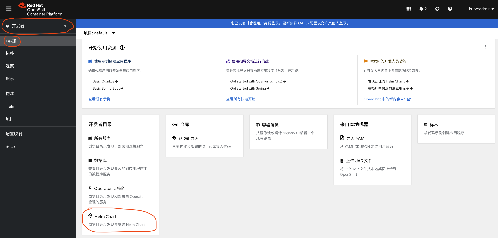

选择自定义的helm chart集 (后面会讲解，如何添加自定义helm chart集)，点击vbbu chart，也就是本演示helm

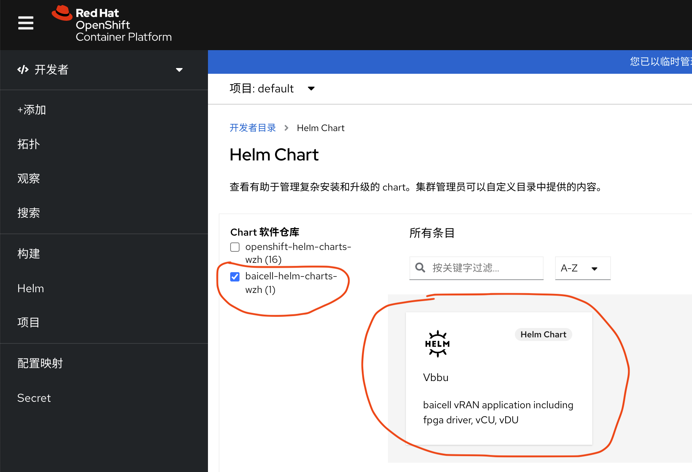

点击安装

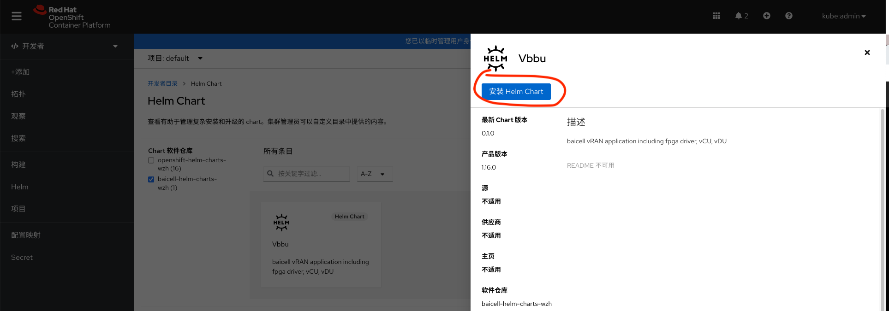

然后可以看到helm的参数范例，是按照单节点openshift做的参数范例。根据需要修改以后，点击安装，就会自动安装应用组件了。

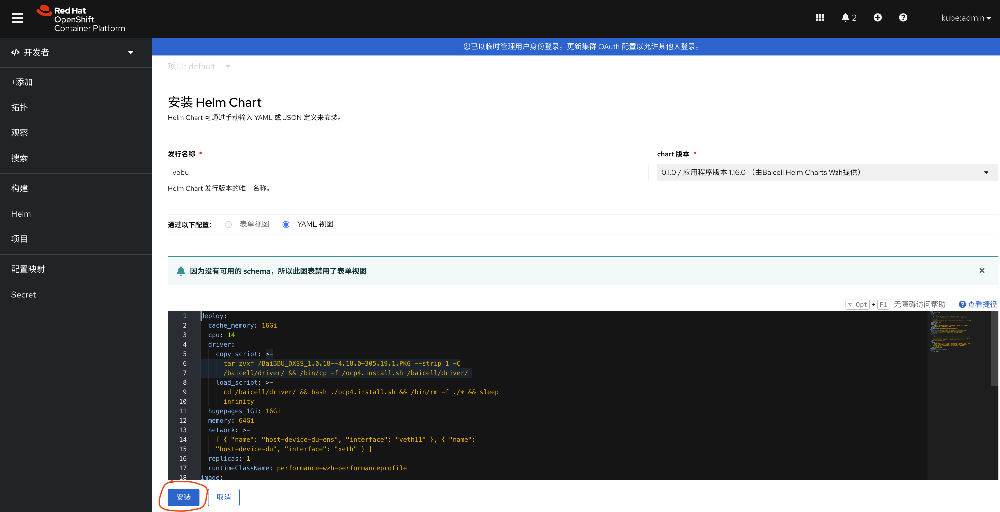

系统会自动把本helm相关部署，放到一个部署框图中。

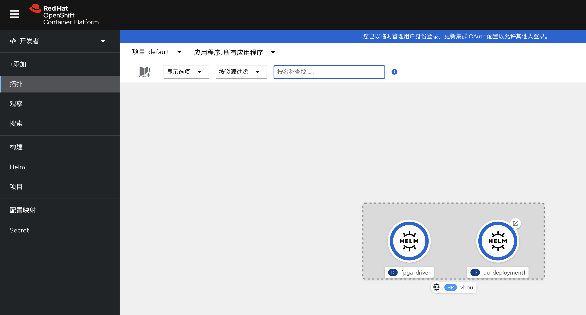

由于本vbbu是带license的，license默认会装一个空的进去，所以应用装完了以后，需要把license更新一下。
```bash
oc create configmap license.for.baicell --from-file=license=./3496531EC238AD91DED6DBA5BD6B.lic -o yaml --dry-run=client | oc apply -f -
```

## 配置helm chart集

这里介绍一下，如何添加自定义helm chart集，只是需要添加一个配置

```bash
cat << EOF > /data/install/helm.baicell.yaml
apiVersion: helm.openshift.io/v1beta1
kind: HelmChartRepository
metadata:
  name: baicell-helm-charts-wzh
spec:
 # optional name that might be used by console
  name: baicell-helm-charts-wzh
  connectionConfig:
    url: https://wangzheng422.github.io/baicell-helm-operator/
EOF
oc create -f /data/install/helm.baicell.yaml

```

如果我们是离线环境，那么我们需要一个nexus来代理一下helm。nexus的配置如下

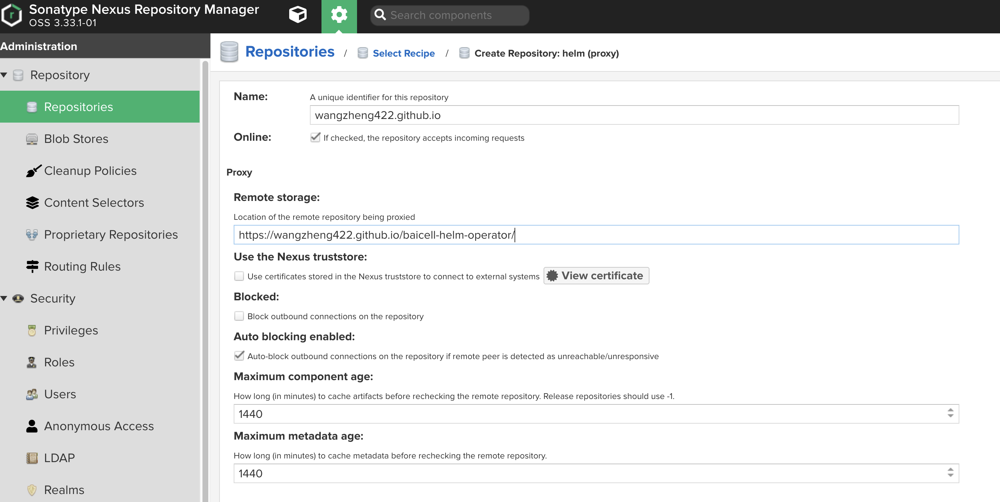

然后我们添加配置，url改一下。
```bash

cat << EOF > /data/install/helm.baicell.yaml
apiVersion: helm.openshift.io/v1beta1
kind: HelmChartRepository
metadata:
  name: baicell-helm-charts-wzh
spec:
 # optional name that might be used by console
  name: baicell-helm-charts-wzh
  connectionConfig:
    url: http://nexus.ocp4.redhat.ren:8082/repository/wangzheng422.github.io/
EOF
oc create -f /data/install/helm.baicell.yaml

```

## 卸载

进入helm菜单，选择helm部署，点击删除。

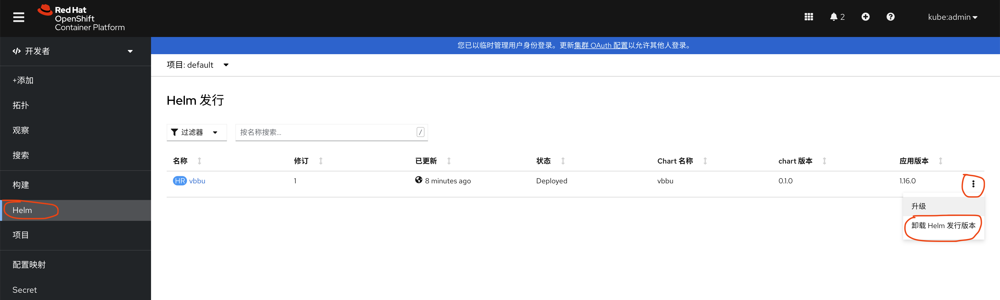

# helm operator

打开openshift管理界面，进入operator hub，搜索baicell ( 如何按照自定义operator源，后面介绍），点击安装

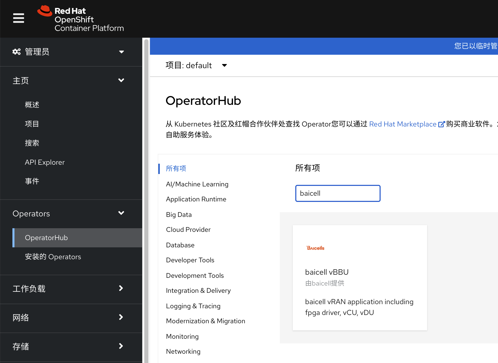

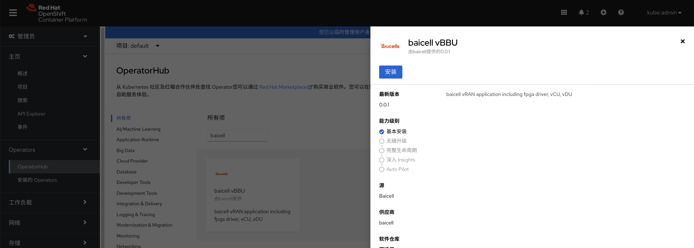

operator参数，默认的就好，不用修改。

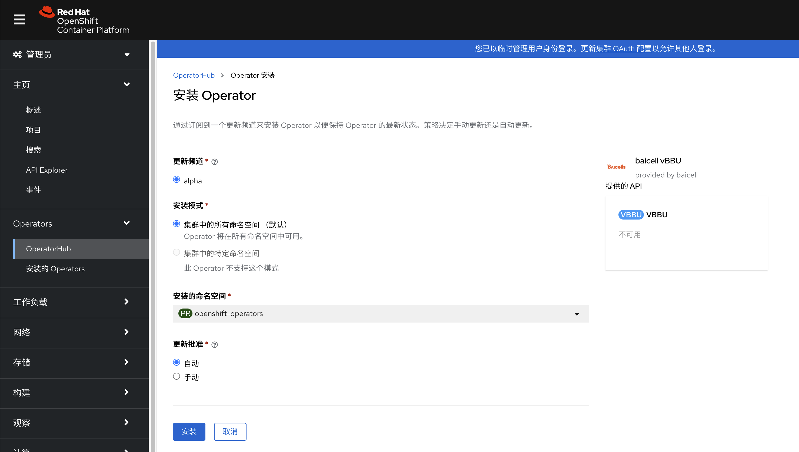

装好了以后，是这样，我们创建一个VBBU CR

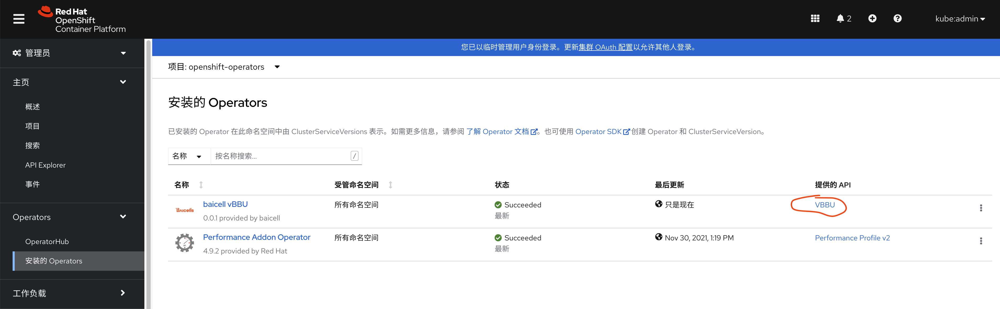

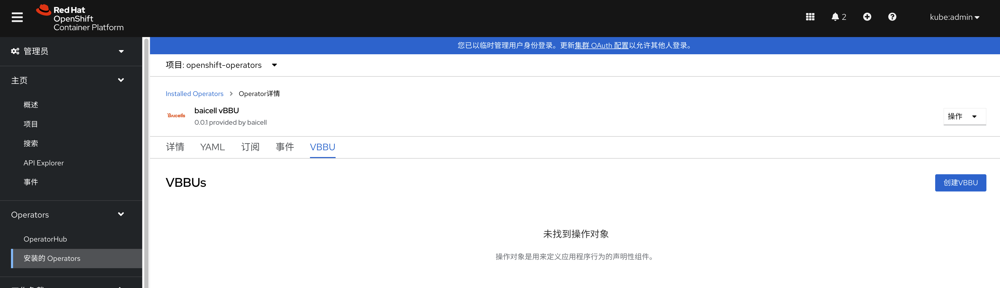

参数根据情况调整，默认的配置，是针对单节点openshift设置的。注意挑选project/namespace，一般会是新创建一个专用的project/namespace

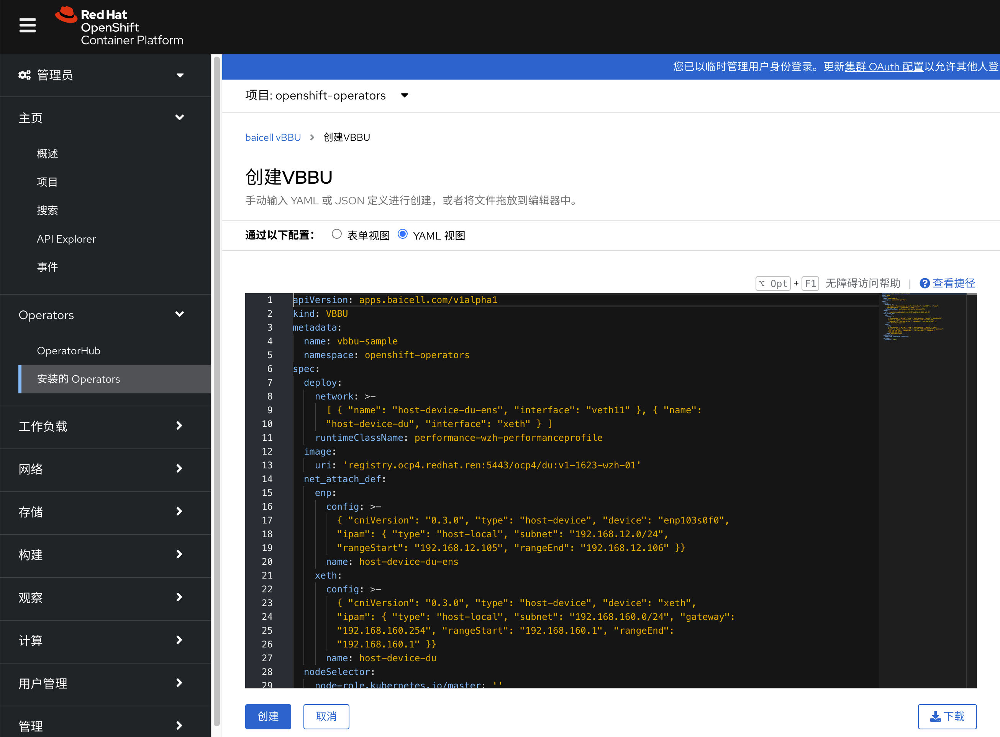

## 配置自定义operator hub源

本软件在没有上架官方operator hub之前，是需要用自定义的operator hub源来导入的，以下是配置，注意其中的镜像，需要选取最新的，[镜像列表在这里](https://github.com/wangzheng422/baicell-helm-operator/pkgs/container/baicell-helm-operator)

```bash
# on openshift helper node
cat << EOF > /data/install/baicell.catalog.yaml
apiVersion: operators.coreos.com/v1alpha1
kind: CatalogSource
metadata:
  name: baicell
  namespace: openshift-marketplace
spec:
  displayName: Baicell
  publisher: Baicell
  sourceType: grpc
  image: ghcr.io/wangzheng422/baicell-helm-operator:catalog-2021-12-03-1051
  updateStrategy:
    registryPoll:
      interval: 10m
EOF
oc create -f /data/install/baicell.catalog.yaml
# to restore
oc delete -f /data/install/baicell.catalog.yaml

```

# 本项目代码介绍

本项目，是使用脚手架创建的，创建命令如下
```bash
operator-sdk init \
    --plugins=helm \
    --project-name baicell-helm-operator \
    --domain=baicell.com \
    --group=apps \
    --version=v1alpha1 \
    --kind=VBBU 
```

helm相关的脚本在 helm-charts目录中。operator相关的配置，在bundle目录中。

本项目采用github action自动编译和发布。自动编译出helm charts，并发布到 https://wangzheng422.github.io/baicell-helm-operator/ . 同时会编译出operator需要的docker镜像，并[发布到package中](https://github.com/wangzheng422/baicell-helm-operator/pkgs/container/baicell-helm-operator)。